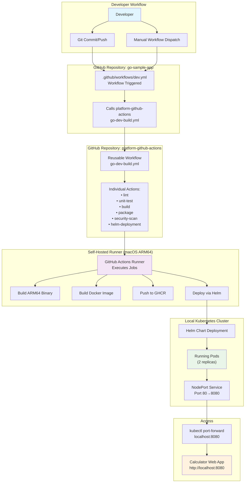
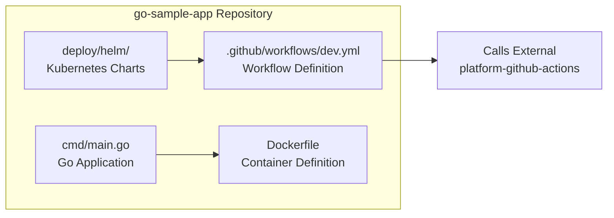
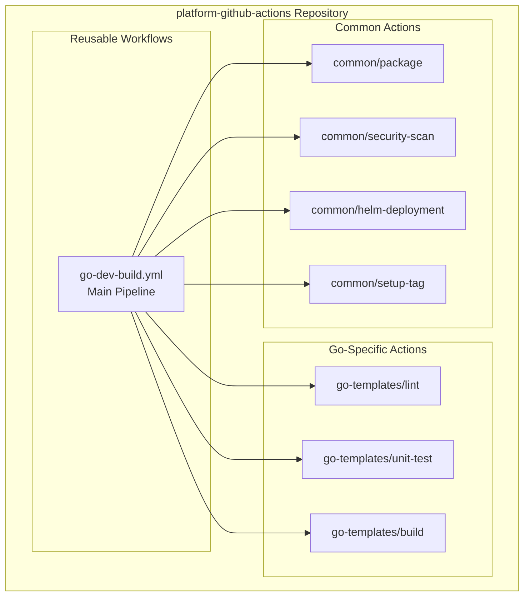
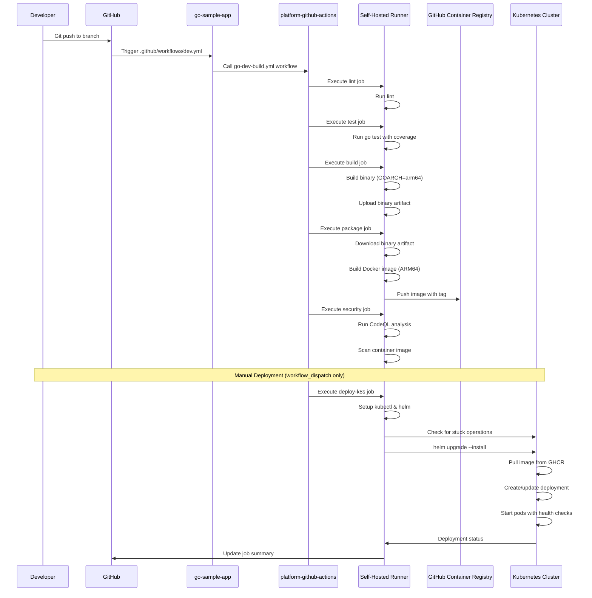
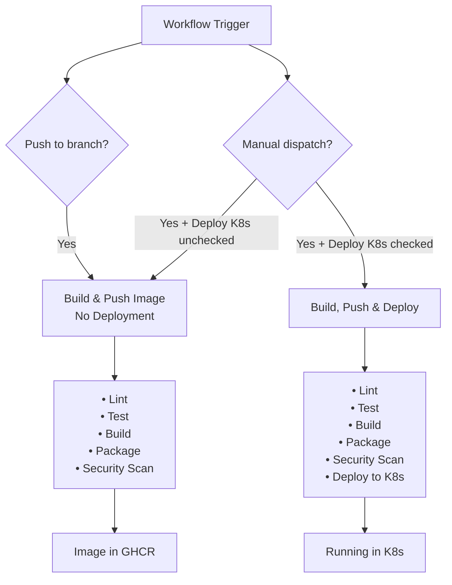

# GitHub Actions CI/CD Flow Architecture

This document explains the complete flow of how the `go-sample-app` gets built, containerized, and deployed using the modular `platform-github-actions` repository, self-hosted runners, and local Kubernetes cluster.

## Overview

The architecture consists of four main components:
1. **go-sample-app** - The Go application with Helm charts
2. **platform-github-actions** - Reusable workflow templates and actions
3. **Self-hosted GitHub Actions Runner** - Executes the workflows locally
4. **Local Kubernetes Cluster** - Target deployment environment

## High-Level Architecture Flow



## Detailed Component Breakdown

### 1. Application Repository Structure



### 2. Platform Actions Repository Structure



## Complete CI/CD Pipeline Flow



## Key Technical Details

### Image Tagging Strategy
- **Format**: `feature-summary-YYYYMMDD.{run_number}`
- **Example**: `feature-summary-20250616.89`
- **Registry**: `ghcr.io/osru-leu/go-sample-app/go-sample-app:tag`

### Architecture Compatibility
- **Build Target**: `GOOS=linux GOARCH=arm64`
- **Runner**: macOS ARM64 (Apple Silicon)
- **Container**: ARM64 compatible
- **Kubernetes**: Local cluster on ARM64

### Health Check Configuration
- **Endpoint**: `/health`
- **Response**: `{"service":"calculator","status":"healthy"}`
- **Probes**: Both liveness and readiness use `/health`

### Service Configuration
- **Type**: NodePort
- **Port Mapping**: 80 → 8080
- **Access**: `kubectl port-forward service/go-sample-app 8080:80`

## Workflow Triggers and Conditions



## Error Handling and Resilience

### Helm Conflict Resolution
```bash
# Automatic cleanup of stuck operations
if helm list -n default --pending --failed | grep -q go-sample-app; then
  echo "⚠️ Found stuck Helm operation, cleaning up..."
  helm uninstall go-sample-app -n default || true
  sleep 5
fi
```

### Authentication
- **GHCR**: Uses `${{ github.token }}` for authentication
- **Kubernetes**: Uses `ghcr-secret` for image pulls
- **Self-hosted**: Runner has direct cluster access

## Monitoring and Observability

### Pipeline Visibility
- **GitHub Actions UI**: Real-time job progress
- **Step Summaries**: Deployment details and status
- **Artifacts**: Test coverage, security reports
- **Container Registry**: Image versions and metadata

### Application Monitoring
- **Health Endpoint**: `/health` for status checks
- **Web Interface**: `http://localhost:8080` for testing
- **API Endpoints**: REST API for calculator operations
- **Kubernetes**: Pod status, service endpoints, logs

## Benefits of This Architecture

1. **Modularity**: Reusable actions across multiple projects
2. **Consistency**: Standardized build and deployment patterns
3. **Local Development**: Self-hosted runner with direct cluster access
4. **Security**: Automated scanning and secure image handling
5. **Flexibility**: Manual deployment control with automatic builds
6. **Observability**: Comprehensive logging and status reporting

This architecture provides a robust, scalable foundation for Go application development and deployment while maintaining developer productivity and operational reliability. 