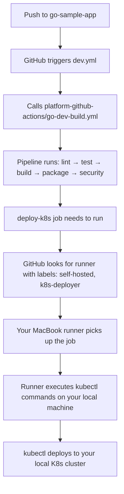

## FLOW OF PLATFORM-GITHUB-ACTIONS

```mermaid
graph TD
    A[Push to go-sample-app] --> B[GitHub triggers dev.yml]
    B --> C[Calls platform-github-actions/go-dev-build.yml]
    C --> D[Pipeline runs: lint → test → build → package → security]
    D --> E[deploy-k8s job needs to run]
    E --> F[GitHub looks for runner with labels: self-hosted, k8s-deployer]
    F --> G[Your MacBook runner picks up the job]
    G --> H[Runner executes kubectl commands on your local machine]
    H --> I[kubectl deploys to your local K8s cluster]
```